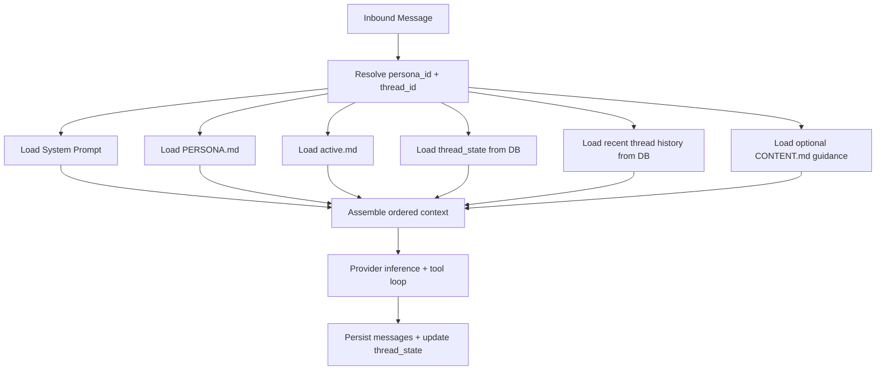
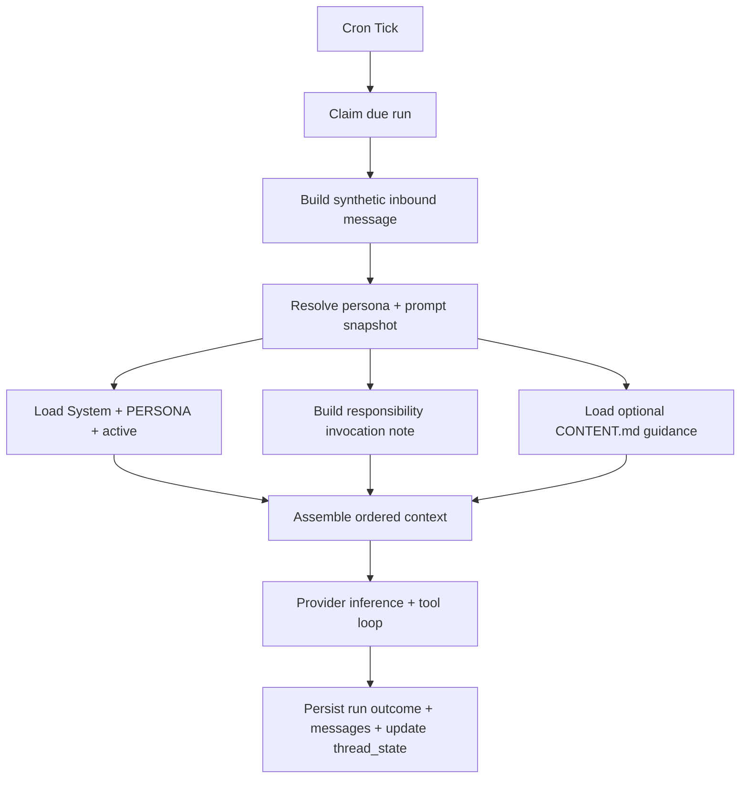
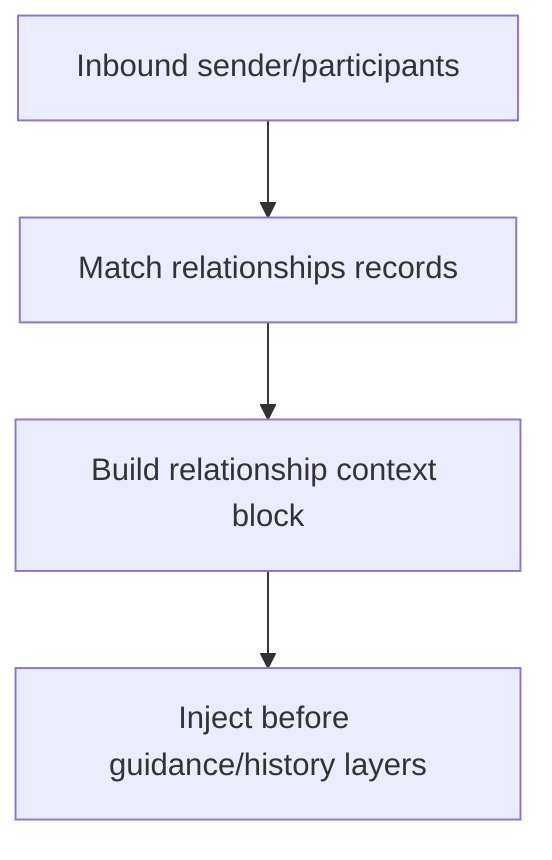
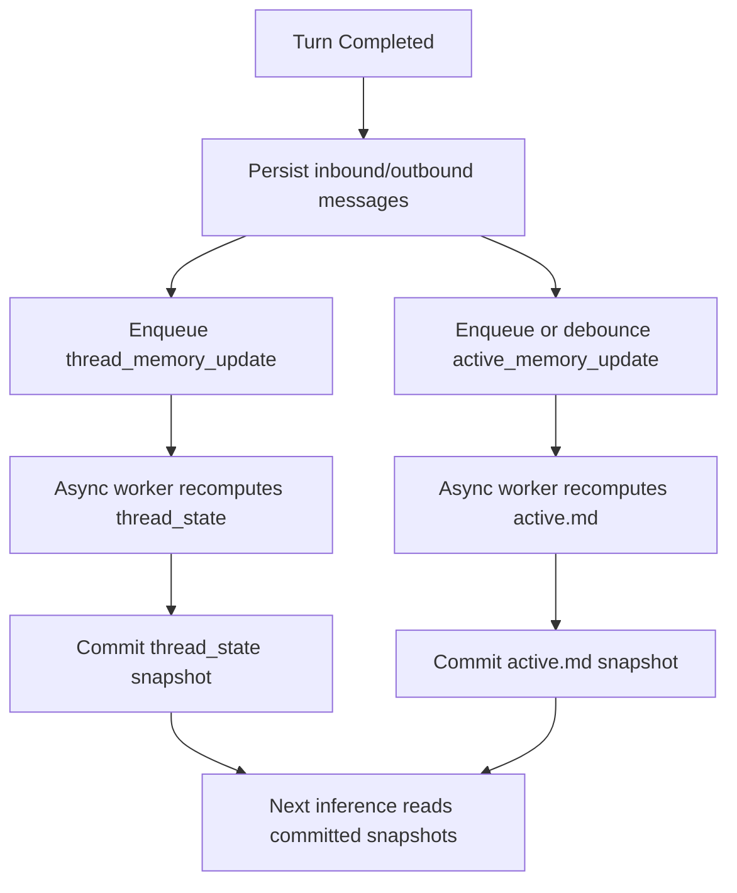

# Milestone Plan: Holistic Context Management

Status: Proposed  
Scope: Define deterministic, reusable context assembly across email threads, scheduler responsibilities, and relationship-aware runs.

## Why This Matters

Context loading is the highest-impact behavior in Protege.  
If context is incomplete, stale, or noisy, the agent becomes unreliable.

This plan defines:

1. What context is loaded.
2. In what order context is loaded.
3. How context continuity is preserved across turns.
4. How knowledge files are used without reloading everything each turn.

## Core Principles (v1)

1. File-first authoring, DB-first runtime continuity.
2. Deterministic layer ordering.
3. Persona-scoped context boundaries.
4. No indexing/chunking in v1.
5. Thread memory persists reasoning continuity at low token cost.
6. Memory synthesis is async; inference reads committed snapshots only.

## Runtime Context Profiles

## Profile A: Email/Chat Thread Turn

Context layers:

1. `System Prompt` (`config/system-prompt.md`)
2. `Persona Prompt` (`personas/{persona_id}/PERSONA.md`)
3. `Persona Active Memory` (`memory/{persona_id}/active.md`)
4. `Thread Memory State` (DB-backed per thread summary/context ledger)
5. `Invocation Metadata` (routing headers and message identity details)
6. `Knowledge Guidance` (`CONTENT.md` hints when present)
7. `Thread History` (budgeted recent conversation turns)
8. `Current Input` (latest inbound message body)

## Profile B: Responsibility Run

Context layers:

1. `System Prompt`
2. `Persona Prompt`
3. `Persona Active Memory` (optional, but on by default in v1)
4. `Responsibility Metadata Note` (id, name, schedule, run id)
5. `Responsibility Prompt Snapshot` (immutable run prompt)
6. `Knowledge Guidance` (`CONTENT.md` hints when present)

Note: scheduler runs remain new-thread synthetic runs per ADR-0017.

## Profile C: Relationship-Enriched Thread (Future)

Context layers:

1. `System Prompt`
2. `Persona Prompt`
3. `Active Memory`
4. `Thread Memory State`
5. `Relationship Context` (matched contact records)
6. `Invocation Metadata`
7. `Knowledge Guidance`
8. `Thread History`
9. `Current Input`

## Data Contracts

## 1) Persona Configuration

`personas/{persona_id}/persona.json` gains persona-configurable knowledge roots:

1. `knowledge_paths: string[]`

Behavior:

1. Relative paths resolve from repository root.
2. Absolute paths are allowed.
3. Non-existent paths are skipped with structured warnings.

## 2) Thread Memory State (DB)

Thread continuity state should be persisted with each thread record load path.

Proposed shape:

1. `thread_id`
2. `persona_id`
3. `working_summary` (rolling summary for continuity)
4. `open_loops` (JSON array of unresolved tasks/questions)
5. `referenced_sources` (JSON array: path, hash, relevance note)
6. `last_updated_at`

Update model:

1. Written by async post-turn updater jobs.
2. Never synthesized inline during provider request execution.

## 2b) Active Memory State (Persona-Level)

`memory/{persona_id}/active.md` remains the persona-level short-horizon memory surface.

Update model:

1. Updated by async cadence/debounced consolidation jobs.
2. Not recomputed inline on every inbound turn.
3. Inference always reads latest committed snapshot at run start.

## 3) Knowledge Guidance File (Filesystem)

Persona-scoped optional guidance:

1. `CONTENT.md` under each configured knowledge root (or root-level knowledge path).
2. Used as orientation only: what content exists, where to look, what each directory/file is for.
3. Agent may still choose to read files directly via tools when needed.

## Context Assembly Order (Hard Rule)

The assembly order is fixed and deterministic:

1. `system`
2. `persona`
3. `active`
4. `thread_state` or `responsibility_note` (source-specific)
5. `invocation_metadata`
6. `knowledge_guidance`
7. `history`
8. `current_input`

No subsystem may reorder layers locally.

## Reload and Caching Policy (v1)

Avoid broad filesystem reloads on each turn.

1. No chunk index is maintained in v1.
2. `CONTENT.md` is loaded when present and cheap to read.
3. Thread state carries continuity between turns so prior context intent is not lost.
4. Deeper file reads happen only when the model decides to use file tools.
5. Memory snapshots may be slightly stale during update lag (eventual consistency by design).

## Token Budgeting Policy (v1 Defaults)

Initial target ceilings per run:

1. Persona + system: always included.
2. Active memory: capped.
3. Thread memory state: capped.
4. Knowledge guidance: small cap for `CONTENT.md` text.
5. History: newest-first in remaining budget.

Final numeric defaults can be tuned per provider model capacity.

## Step-by-Step Story: Later Thread Turn

When turn N arrives in an existing thread:

1. Resolve persona and thread.
2. Load system/persona/active files.
3. Load thread state from DB.
4. Load budgeted recent thread history from DB.
5. Load optional `CONTENT.md` guidance from configured knowledge roots.
6. Assemble final ordered context.
7. Model decides whether to read deeper files using tools.
8. Run inference/tool loop.
9. Persist:
   1. inbound/outbound messages
   2. enqueue async `thread_memory_update` job
   3. enqueue/debounce async `active_memory_update` job
10. Background updater commits thread-memory and active-memory snapshots.
11. Next turn reuses committed snapshots and avoids cold-start context loss.

## Async Memory Lifecycle

Inference critical path:

1. Read committed `thread_state` + `active.md`.
2. Generate response and persist messages.
3. Enqueue memory update jobs.
4. Return without waiting for summarization jobs.

Background memory path:

1. Consume `thread_memory_update(persona_id, thread_id, message_ids)`.
2. Recompute and persist thread summary/open loops/source refs.
3. Consume/debounce `active_memory_update(persona_id)`.
4. Recompute and write `active.md`.

Failure behavior:

1. Memory update job failure does not fail the already-completed turn.
2. Failures are logged and retried with bounded policy.
3. Last committed snapshot remains valid fallback.

## Frontmatter and CONTENT.md Guidance

Frontmatter is optional enhancement, not required user burden.

1. If present, use fields such as `title`, `tags`, `summary` as model hints.
2. If absent, agent relies on file names, directory layout, and `CONTENT.md` guidance.

`CONTENT.md` is optional directory-level guidance:

1. Useful for curated directories.
2. Never required for baseline operation.

## Implementation Phases

## CM1: Contracts and Schema

- [ ] Add typed context profile and layer contracts.
- [ ] Add DB migration for thread state tables.
- [ ] Add persona `knowledge_paths` parsing and validation.

## CM2: Thread Memory Runtime

- [ ] Read committed `thread_state` snapshot on every thread run.
- [ ] Enqueue async thread-memory update after each completion.
- [ ] Add structured logs for state updates.
- [ ] Add bounded retry + dedupe for thread-memory update jobs.

## CM2b: Active Memory Runtime

- [ ] Read committed `active.md` snapshot at run start.
- [ ] Enqueue/debounce async active-memory consolidation jobs.
- [ ] Add cadence controls and bounded retry policy for updater jobs.
- [ ] Log updater lag/failures without failing request lifecycle.

## CM3: Knowledge Guidance (No Indexing in v1)

- [ ] Add optional `CONTENT.md` loading for configured knowledge paths.
- [ ] Add small-budget guidance layer injection.
- [ ] Keep deeper reads tool-driven (no prefetch/chunking/index).

## CM4: Responsibility Integration

- [ ] Apply same layered pipeline to responsibility runs.
- [ ] Ensure responsibility metadata note and prompt snapshot behavior stays explicit.

## CM5: Relationship Layer (Future)

- [ ] Define `relationships/` schema and matching strategy.
- [ ] Add relationship context block and precedence contract.

## CM6: Testing and Observability

- [ ] Unit tests for layer ordering and source-specific profile selection.
- [ ] Unit tests for thread-state continuity updates.
- [ ] Unit tests for async job enqueue/debounce/dedupe behavior.
- [ ] Integration tests proving inference succeeds when updater fails.
- [ ] Integration tests for `CONTENT.md` presence/absence behavior.
- [ ] E2E tests for multi-turn thread continuity with tool-driven file reads.
- [ ] Log events for context composition summaries and budgets.

## Exit Criteria

1. Multi-turn threads retain important prior context without full reloads.
2. Scheduler responsibilities use the same context architecture.
3. Persona knowledge roots are configurable and validated.
4. Layer ordering is deterministic and test-covered.
5. Thread state continuity is persisted and visible in diagnostics.
6. Async memory synthesis is reliable and does not block inference lifecycle.
