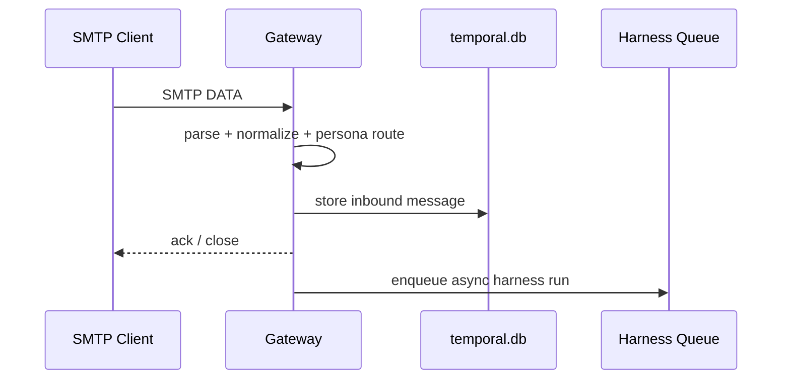

# Gateway

Gateway is the protocol edge for Protege runtime.

## Responsibilities

- parse inbound SMTP into `InboundNormalizedMessage`
- route inbound by recipient local-part to persona
- enforce gateway sender access policy (`config/security.json`)
- persist inbound message before async harness execution
- execute runtime actions used by tools
- send outbound via SMTP transport or relay tunnel

## Inbound Pipeline

## Runtime Actions Exposed

`createGatewayRuntimeActionInvoker` supports:

- `file.read`
- `file.write`
- `file.edit`
- `file.glob`
- `file.search`
- `web.fetch`
- `web.search`
- `shell.exec`
- `email.send`

## Outbound Send Resolution

For `email.send`:

1. build request from tool payload + inbound context
2. resolve sender as persona mailbox identity
3. if SMTP transport configured, send via transport
4. else if relay client exists for persona, send via relay tunnel
5. else fail (`Outbound transport is not configured for email.send.`)

## Threading Behavior

Default threading mode is same-thread reply unless `threadingMode: "new_thread"` is explicitly requested.

## Relay Client Integration

When relay is enabled, gateway starts one relay websocket client per persona.

- challenge-response auth
- reconnect backoff
- heartbeat timeout
- binary tunnel frame ingest
- delivery-control message handling
