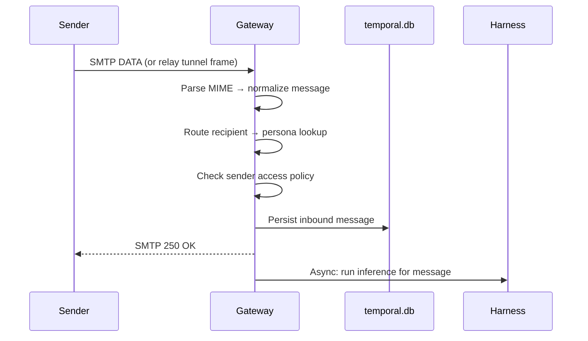

# Gateway

The gateway is the protocol edge for Protege. It handles everything related to receiving and sending email, and it provides the runtime action layer that tools use to perform side effects.

## What the Gateway Does

1. **Receives inbound email** — via local SMTP server or relay WebSocket tunnel
2. **Routes messages to personas** — matches recipient addresses to persona identities and aliases
3. **Enforces access policy** — checks sender against `configs/security.json` rules
4. **Persists messages** — stores inbound messages in the persona's database before running inference
5. **Executes runtime actions** — provides the concrete implementations for tool calls (file I/O, shell, web, email)
6. **Sends outbound email** — via direct SMTP transport or relay tunnel

## Inbound Pipeline

When an email arrives, here's the exact sequence:

Key design choice: the gateway acknowledges the inbound message **before** inference runs. This means the sender gets a quick SMTP response, and the (potentially slow) LLM inference happens asynchronously.

## Runtime Actions

Tools don't directly perform side effects. Instead, they call `context.runtime.invoke()` with an action name and payload. The gateway maps these to concrete implementations:

| Action | What it does |
|--------|-------------|
| `file.read` | Read a file from the filesystem |
| `file.write` | Write content to a file |
| `file.edit` | Find-and-replace within a file |
| `file.glob` | Find files matching a glob pattern |
| `file.search` | Search file contents for a string |
| `web.fetch` | HTTP GET a URL and return the content |
| `web.search` | Query a web search provider |
| `shell.exec` | Execute a shell command |
| `email.send` | Send an outbound email |

This separation means tools are pure logic (validate input, call an action, format the result), while the gateway owns all I/O and side effects.

## Outbound Email Resolution

When the `email.send` action fires:

1. Build the outbound message from the tool payload and inbound context
2. Set the sender to the persona's email address
3. **If SMTP transport is configured** → send directly via the transport
4. **Else if relay is connected** → send through the relay tunnel
5. **Else** → fail with "outbound transport is not configured"

### Threading

By default, outbound emails reply in the same thread as the inbound message (using `In-Reply-To` and `References` headers). The LLM can request `threadingMode: "new_thread"` to start a separate email thread.

## Relay Integration

When relay mode is enabled, the gateway starts one WebSocket client per persona:

1. **Authentication** — challenge-response using the persona's Ed25519 key
2. **Reconnection** — exponential backoff between `reconnectBaseDelayMs` and `reconnectMaxDelayMs`
3. **Heartbeat** — the connection is dropped if no heartbeat within `heartbeatTimeoutMs`
4. **Inbound tunnel** — relay streams SMTP frames to the gateway for reassembly
5. **Outbound tunnel** — gateway sends email payloads to relay for SMTP delivery
6. **Delivery signals** — relay sends `relay_delivery_result` control messages back to confirm or report delivery failures

## Source Files

| File | Purpose |
|------|---------|
| `engine/gateway/index.ts` | Gateway startup, config loading |
| `engine/gateway/inbound.ts` | Inbound SMTP handling and message normalization |
| `engine/gateway/outbound.ts` | Outbound email resolution and sending |
| `engine/gateway/relay-client.ts` | WebSocket relay client |
| `engine/gateway/relay-tunnel.ts` | Tunnel frame codec |
| `engine/gateway/threading.ts` | Email threading logic |
