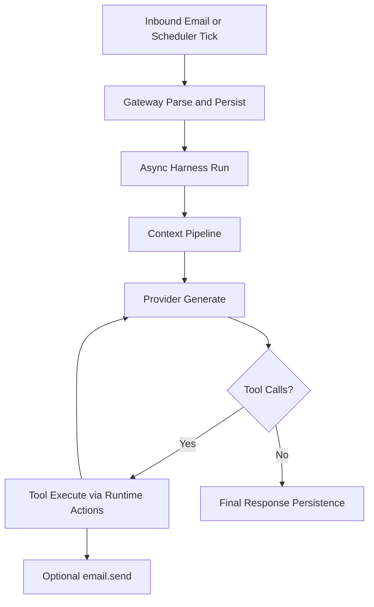

# Internal Architecture

This section documents how runtime components are split and coordinated.

## Component Map

- Gateway (`engine/gateway/`): SMTP ingress/egress, relay tunnel client, runtime actions.
- Harness (`engine/harness/`): context assembly, provider loop, tool orchestration, persistence hooks.
- Scheduler (`engine/scheduler/`): responsibility sync, cron enqueue, run execution.
- Chat (`engine/chat/`): TUI inbox/thread client over shared temporal storage.
- Relay (`relay/`): optional external SMTP↔WS bridge service.

## High-Level Runtime Flow

## Storage Model

Per persona:

- configs/identity in `personas/{persona_id}/`
- runtime DB and memory in `memory/{persona_id}/`

Thread timeline continuity uses:

- `messages`
- `thread_tool_events`

## Read Next

- [LOGI Model](/internal-architecture/logi)
- [Gateway](/internal-architecture/gateway)
- [Inference Harness](/internal-architecture/harness)
- [Scheduler](/internal-architecture/scheduler)
- [Relay Service](/internal-architecture/relay)
