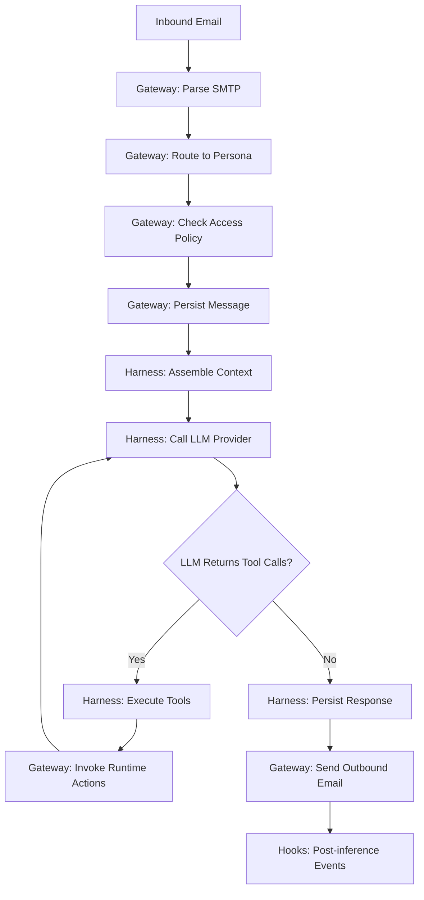

# Internal Architecture

This section explains how Protege's runtime components are structured and how they coordinate. You don't need to read this to use Protege, but it helps if you're building custom extensions, debugging issues, or contributing to the framework.

## Component Map

Protege has five major components:

```
┌──────────────────────────────────────────────────────────┐
│                      Your Machine                        │
│                                                          │
│  ┌───────────────┐   ┌──────────────┐   ┌─────────────┐  │
│  │   Gateway     │───│   Harness    │───│  Scheduler  │  │
│  │ (SMTP edge,   │   │ (context,    │   │ (cron,      │  │
│  │  relay client,│   │  LLM calls,  │   │  run queue, │  │
│  │  actions)     │   │  tool loop)  │   │  execution) │  │
│  └───────────────┘   └──────────────┘   └─────────────┘  │
│          │                                               │
│  ┌───────────────┐                      ┌─────────────┐  │
│  │    Chat       │                      │  Extensions │  │
│  │ (terminal UI  │                      │ (tools,     │  │
│  │  over shared  │                      │  providers, │  │
│  │  storage)     │                      │  hooks,     │  │
│  └───────────────┘                      │  resolvers) │  │
│                                         └─────────────┘  │
└──────────────────────────────────────────────────────────┘
          │
          ▼ (optional)
┌───────────────────┐
│   Relay Server    │  ← External, public SMTP bridge
│ (SMTP ↔ WebSocket)│
└───────────────────┘
```

| Component | Directory | Role |
|-----------|-----------|------|
| **Gateway** | `engine/gateway/` | SMTP ingress/egress, relay tunnel, runtime actions |
| **Harness** | `engine/harness/` | Context assembly, LLM provider loop, tool orchestration |
| **Scheduler** | `engine/scheduler/` | Responsibility sync, cron, run queue, execution |
| **Chat** | `engine/chat/` | Terminal inbox/thread client over shared storage |
| **Relay** | `relay/` | Optional external SMTP-to-WebSocket bridge |

## Request Lifecycle

Here's what happens when your agent receives an email:



Scheduled responsibilities follow the same path, but instead of a real inbound email, the scheduler creates a synthetic message from the responsibility's prompt text.

## Storage Model

Each persona has isolated storage:

- **Identity and config** → `personas/{persona_id}/` (persona.json, keys, PERSONA.md, responsibilities, knowledge)
- **Runtime data** → `memory/{persona_id}/` (SQLite database, active memory, attachments, logs)

The SQLite database (`temporal.db`) stores threads, messages, tool traces, and scheduler run records. Chat, gateway, and scheduler all read/write from the same database.

## Read More

- [LOGI Model](/internal-architecture/logi) — the architectural pattern behind Protege
- [Gateway](/internal-architecture/gateway) — protocol edge and runtime actions
- [Inference Harness](/internal-architecture/harness) — context assembly and the LLM tool loop
- [Scheduler](/internal-architecture/scheduler) — responsibility execution
- [Relay Service](/internal-architecture/relay) — the optional SMTP bridge
