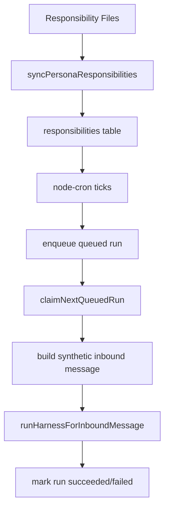

# Scheduler

Scheduler is gateway-owned runtime that executes persona responsibilities.

## Design

- responsibilities are file-first markdown in persona directories
- DB stores indexed responsibility metadata and run records
- cron layer enqueues run records
- runner claims queued runs and executes through harness

## Responsibility Source

`personas/{persona_id}/responsibilities/{responsibility_id}.md`

Required frontmatter:

- `name`
- `schedule`
- `enabled`

Body is prompt text.

## Runtime Flow



## Concurrency and Guardrails

- one active run per responsibility (no-overlap)
- global cap from `system.json -> scheduler.max_global_concurrent_runs`
- overlap skips are persisted as `skipped_overlap`

## Run Outcomes

Run statuses include:

- `queued`
- `running`
- `succeeded`
- `failed`
- `skipped_overlap`
- `skipped_concurrency` (reserved)

Failure categories currently:

- `config`
- `runtime`
- `unknown`

## Startup Recovery

Interrupted `running` rows are finalized as failed on startup to prevent permanent overlap lock.

## Control Plane Command

```bash
protege scheduler sync [--persona <persona_id_or_prefix>]
```

This command reconciles file definitions into DB index rows.
