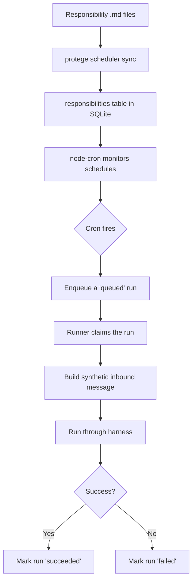

# Scheduler

The scheduler runs your agent's recurring tasks. It reads responsibility definitions from markdown files, tracks cron schedules, manages a run queue, and executes tasks through the same harness used for email processing.

## How Scheduling Works



### Responsibility files

Responsibilities live in `personas/{persona_id}/responsibilities/` as markdown files with frontmatter:

```markdown
---
name: weekly-report
schedule: "0 9 * * 1"
enabled: true
---

Generate a summary of all conversations from the past week.
Include key topics, action items, and any unresolved questions.
Email the report to admin@example.com with subject "Weekly Agent Report".
```

The `schedule` field uses standard 5-field cron syntax:

```
┌──────── minute (0-59)
│ ┌────── hour (0-23)
│ │ ┌──── day of month (1-31)
│ │ │ ┌── month (1-12)
│ │ │ │ ┌ day of week (0-7, 0 and 7 = Sunday)
│ │ │ │ │
* * * * *
```

Common examples:
- `0 8 * * *` — every day at 8:00 AM
- `0 9 * * 1` — every Monday at 9:00 AM
- `*/30 * * * *` — every 30 minutes
- `0 0 1 * *` — first day of each month at midnight

### Syncing responsibilities

After creating or editing responsibility files, sync them to the database:

```bash
protege scheduler sync
```

Or for a specific persona:

```bash
protege scheduler sync --persona 5d52
```

This reads the markdown files, validates the frontmatter, and upserts the metadata into the `responsibilities` table.

## Concurrency Controls

The scheduler prevents tasks from stepping on each other:

- **No overlap per responsibility** — if a responsibility is already running, the next cron tick is skipped (recorded as `skipped_overlap`)
- **Global concurrency cap** — `max_global_concurrent_runs` in `configs/system.json` limits total simultaneous runs across all personas and responsibilities (default: 5)

## Run States

Each scheduled run goes through these states:

| State | Meaning |
|-------|---------|
| `queued` | Cron fired, run is waiting to be claimed |
| `running` | A runner has claimed and is executing the run |
| `succeeded` | Harness completed successfully |
| `failed` | Harness threw an error |
| `skipped_overlap` | Cron fired but previous run was still active |

### Failure categories

When a run fails, it's categorized:

| Category | Meaning |
|----------|---------|
| `config` | Bad configuration (missing persona, invalid responsibility) |
| `runtime` | Runtime error during inference or tool execution |
| `unknown` | Unclassified error |

## Startup Recovery

If the scheduler process crashes while runs are in `running` state, those rows would permanently block future runs (due to the no-overlap rule). On startup, the scheduler finalizes any `running` rows as failed, clearing the lock.

## How Runs Execute

When a responsibility fires:

1. The scheduler creates a **synthetic inbound message** using the responsibility's body text as the message content
2. This message is processed through the normal harness pipeline — same context assembly, same LLM call, same tool execution
3. The response is persisted in the persona's database
4. If the LLM calls `send_email`, the email is sent through the gateway's outbound path

This means scheduled tasks have access to all the same tools and context as email-triggered runs.

## Source Files

| File | Purpose |
|------|---------|
| `engine/scheduler/runtime.ts` | Scheduler lifecycle and coordination |
| `engine/scheduler/cron.ts` | Cron schedule management |
| `engine/scheduler/runner.ts` | Run claiming and execution |
| `engine/scheduler/sync.ts` | Responsibility file sync |
| `engine/scheduler/storage.ts` | Run record persistence |
